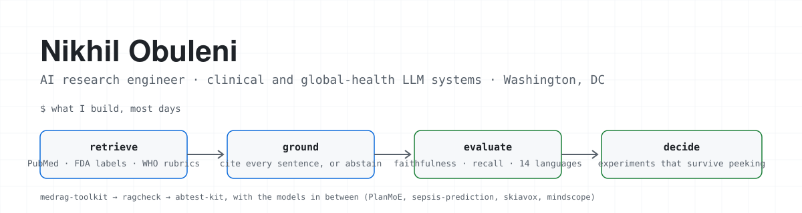

<picture>
  <source media="(prefers-color-scheme: dark)" srcset="banner-dark.svg">
  
</picture>

I build LLM systems for people who cannot afford a wrong answer: clinicians, counselors, and field teams in low-resource settings. Most of my code falls into one of four stages, and I keep a repo for each.

<table>
<tr>
<th align="left" width="25%">retrieve &amp; ground</th>
<th align="left" width="25%">model</th>
<th align="left" width="25%">evaluate</th>
<th align="left" width="25%">decide</th>
</tr>
<tr valign="top">
<td>

**[medrag-toolkit](https://github.com/nik-hill-323/medrag-toolkit)**
Medical question answering over PubMed, OpenFDA and RxNorm. Hybrid dense + BM25 retrieval. Every sentence is checked against its source; anything unsupported is dropped, and it abstains rather than guesses.

</td>
<td>

**[PlanMoE](https://github.com/nik-hill-323/planmoe)** Mixture of experts over room-constraint graphs, INT8 quantized, on HF Spaces.

**[sepsis-prediction](https://github.com/nik-hill-323/sepsis-prediction)** BiLSTM that flags ICU sepsis risk 6 to 12 hours early.

**[skiavox](https://github.com/nik-hill-323/skiavox)** Chest X-ray ensemble with Grad-CAM and DICOM in.

**[mindscope](https://github.com/nik-hill-323/mindscope)** Mental health NLP benchmark, 15+ conditions, BERT and Claude baselines.

</td>
<td>

**[ragcheck](https://github.com/nik-hill-323/ragcheck)**
Scores retrieval, faithfulness, relevance and citation coverage separately, and prints the exact sentences a RAG answer made up. Offline judge for CI, LLM judge for depth, a `gate` command that fails the build.

</td>
<td>

**[abtest-kit](https://github.com/nik-hill-323/abtest-kit)**
Power analysis, z and Welch tests, Bayesian expected loss, always-valid sequential tests, CUPED. Each method is tested against an independent reference. The peeking demo: naive t-test 32% false positives, mSPRT 1.8%.

</td>
</tr>
</table>

## log

| when | what |
|---|---|
| **Sep 2026** | Published `ragcheck` and `abtest-kit`. Both green on CI across Python 3.10 to 3.12. |
| **Aug 2026** | `medrag-toolkit` and `PlanMoE` went public. Rebuilt the portfolio site on Next.js. |
| **Mar 2026** | Joined the Center for Global Mental Health Equity at GWU as an AI research engineer. The agent pipeline I shipped scores counselor competency across 26K+ transcripts in 25 countries and cut per-session review from 45 minutes to 4. |
| **2025 – 2026** | ML engineer at Data Science for Sustainable Development: NLP extraction over sustainability reports and ARIMA/LSTM/XGBoost forecasting on 200K+ humanitarian records across 18 countries. |
| **Jan 2025** | Started the M.S. in Data Science at George Washington University. GPA 3.75, finishing Dec 2026. |
| **2023** | Drone object detection and predictive maintenance at Asteria Aerospace, Bangalore. |

## what the evaluation work found

Comparing GPT-4 and Claude against human-annotated ground truth across 14 languages turned up a **23% calibration gap on low-resource languages**. A RAG layer grounded in WHO EQUIP/ENACT rubrics, with reranking and hallucination flagging, brought the factual error rate down by about 40% on held-out multilingual benchmarks. Those findings feed a joint study with OpenAI on clinical LLM deployment. `ragcheck` is the open-source distillation of that measurement work.

## toolbox

Plus the parts without icons: LangChain and LangGraph, the OpenAI and Anthropic APIs, FAISS, Pinecone, Qdrant and pgvector, RAGAS, DeepEval and LangSmith, Hugging Face, spaCy, XGBoost and LightGBM, PySpark, Airflow, BigQuery, MLflow, Streamlit.

## activity

## elsewhere

[portfolio](https://nik-hill-323.github.io/Nikhil_Obuleni/) · [resume](https://nik-hill-323.github.io/Nikhil_Obuleni/Nikhil_Obuleni_AI_Engineer.pdf) · [linkedin](https://www.linkedin.com/in/nikhil-obuleni) · nikhil.obuleni@gwu.edu

Open to AI engineer and data scientist roles from 2027. If you work on AI for health and want a second pair of eyes on an evaluation setup, my inbox is open.
